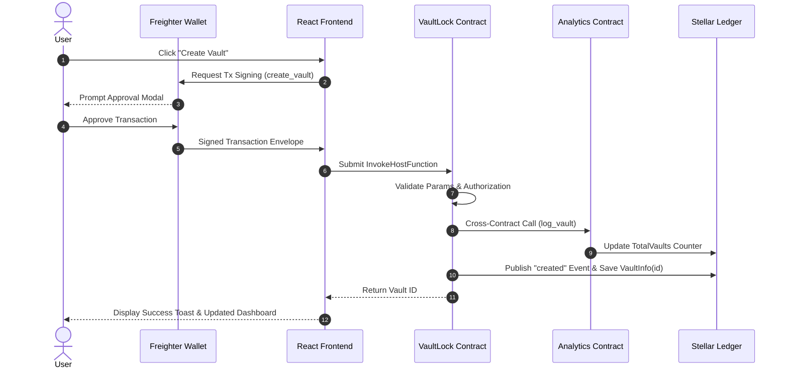
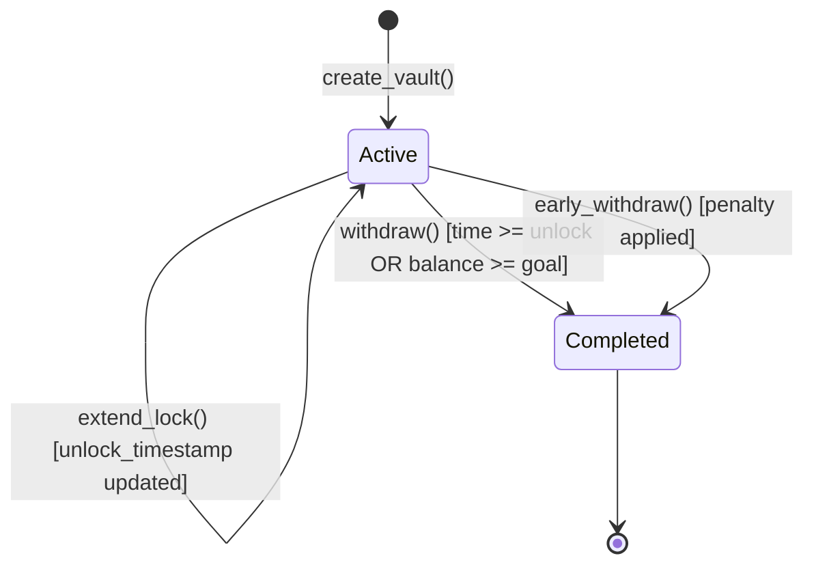

# 🏗️ VaultLock (StellarVault) System Architecture & Gas Optimization

This document outlines the technical design decisions, data storage schemas, and performance optimization techniques used in **VaultLock** to ensure production readiness on Stellar Soroban.

---

## 1. Soroban State Storage Design (`DataKey`)

To minimize ledger storage bloat and optimize gas consumption across transactions, VaultLock avoids storing monolithic user arrays or unbounded vectors. Instead, it utilizes exact, isolated data keys (`DataKey::VaultInfo(u64)` and `DataKey::UserVaults(Address)`):

```rust
#[contracttype]
#[derive(Clone, Debug, Eq, PartialEq)]
pub enum DataKey {
    Config,                     // Singleton global contract configuration
    VaultInfo(u64),             // O(1) direct lookup per vault instance
    UserVaults(Address),        // Vector of vault IDs owned by a specific address
    Counter,                    // Monotonically increasing u64 ID generator
}
```

### Gas & Cost Efficiency Benefits:
- **O(1) Entry Resolution:** Retrieving or updating a specific vault (`withdraw(vault_id)`) only loads one single entry from the Soroban storage ledger.
- **Zero Cross-User Contention:** Multiple concurrent users creating or depositing into their vaults do not lock or modify overlapping storage keys, enabling high throughput on Stellar Testnet and Mainnet.

---

## 2. Penalty & Fee Calculation Accuracy

Floating-point operations (`f32`, `f64`) are avoided in Soroban smart contracts to prevent rounding errors and non-deterministic execution across nodes. All percentage calculations utilize **basis points (`bps`)**:

```rust
// Formula: penalty = (balance * penalty_bps) / 10000
let penalty = (vault.balance * config.penalty_bps as i128) / 10000;
let payout = vault.balance - penalty;
```

With `penalty_bps = 500` (`5.00%`), the split between the vault owner and the community fee treasury (`config.fee_recipient`) is computed with exact 128-bit integer precision.

---

## 4. Protocol Interaction Sequence Diagram

The diagram below illustrates the end-to-end transaction flow for vault creation, deposit, cross-contract telemetry logging, and withdrawal processing:



---

## 5. Vault State Machine Lifecycle



