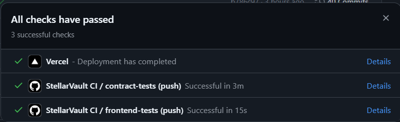
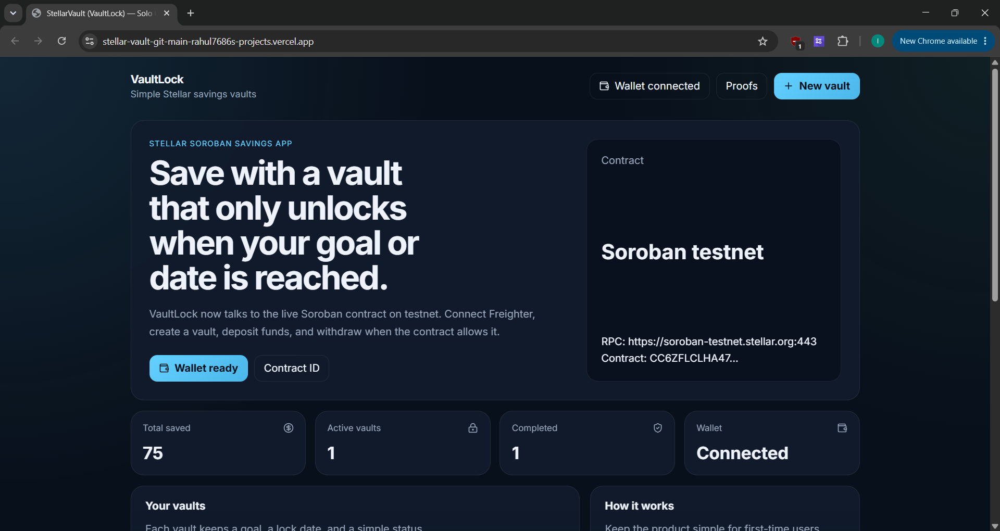
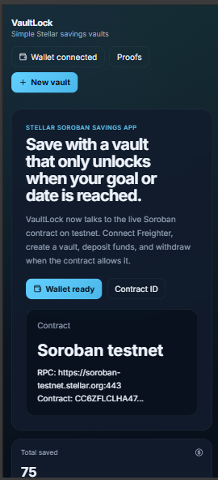

# VaultLock

VaultLock is a Stellar Soroban savings MVP that lets a user create a vault, deposit funds over time, and withdraw only when the unlock date or savings goal is reached.

## Overview

- Product: personal savings vaults with goal and time locks
- Network: Stellar testnet
- Wallet flow: Freighter connect, approve access, create vault, deposit, withdraw
- Contract status: deployed and recorded in `contracts/vaultlock/testnet_config.json`
- Cross-contract call: VaultLock logs vault/deposit stats into `contracts/analytics/`

## Evidence

| Item | Status | Value |
| --- | --- | --- |
| Local demo | Done | `http://localhost:5173` |
| Live demo | Missing | `MISSING` |
| Demo video | Missing | `MISSING` |
| Contract ID | Done | `CC6ZFLCLHA47H64NRZFBD65RLJBOTWW5AJCXEBUWASAIYZLCMU7UPZFX` |
| Deployment tx | Done | `6d89041507874de018b73956e51017ef464b7b22f8468344345141d8a618c2c7` |
| Upload tx | Done | `b76ca5d844bfa43af692c5ef90d6eb3e0d860e73dad4240fc11ac57d3` |
| CI/CD screenshot | Done | `shown below` |
| Mobile screenshot | Done | `shown below` |
| Test proof | Done | `cargo test` passes with 7 tests |
| Analytics setup | Done | `contracts/analytics/` + cross-contract calls |
| Wallet proof | Done | `shown below` |
| Feedback summary | Missing | `MISSING` |

## Screenshots

### CI/CD


### Desktop


### Wallet


## What It Does

- Create a savings vault with a goal amount, unlock date, and asset
- Deposit XLM into the vault
- Lock withdrawals until the goal or time condition is met
- Support an optional early withdrawal path with a penalty
- Show vault progress, status, and recent activity in the UI

## Why Stellar

- Low fees make small recurring deposits practical
- Fast finality keeps the app responsive
- Soroban smart contracts enforce the lock on-chain

## Production Checklist

- Responsive frontend
- Loading states and error handling
- Testnet deployment
- Contract unit tests
- Freighter wallet flow
- Mobile layout support
- README proof sections

## Project Structure

- `contracts/vaultlock/` - Soroban smart contract and Rust tests
- `frontend/` - React + TypeScript dashboard
- `ARCHITECTURE.md` - design notes and storage model
- `RELEASE_NOTES.md` - release summary

## Contract API

- `initialize(fee_recipient, penalty_bps)`
- `create_vault(owner, title, goal_amount, unlock_timestamp, asset)`
- `deposit(depositor, vault_id, amount)`
- `withdraw(vault_id)`
- `early_withdraw(vault_id)`
- `get_vault(vault_id)`
- `get_user_vaults(owner)`

## Local Development

### Contract

```bash
cd contracts/vaultlock
cargo test
```

### Frontend

```bash
cd frontend
npm install
npm run dev
```

### Connect Freighter and Run

1. Start the frontend, then open `http://localhost:5173`.
2. Click `Connect Freighter` and approve wallet access.
3. The dashboard loads vaults from the testnet contract in `contracts/vaultlock/testnet_config.json`.
4. Use `New vault` to create a savings vault, then `Deposit` or `Withdraw` when the contract marks it ready.
5. To point the app at another deployment, set `VITE_VAULTLOCK_RPC_URL`, `VITE_VAULTLOCK_NETWORK_PASSPHRASE`, and `VITE_VAULTLOCK_CONTRACT_ID` in `frontend/.env`.

### Frontend Configuration

Copy `frontend/.env.example` to `frontend/.env` and fill in the values you want to use for the live contract.

Required variables:

- `VITE_VAULTLOCK_RPC_URL`
- `VITE_VAULTLOCK_NETWORK_PASSPHRASE`
- `VITE_VAULTLOCK_CONTRACT_ID`

The legacy deploy script also accepts:

- `VITE_SOROBAN_RPC_URL`
- `VITE_NETWORK_PASSPHRASE`
- `VITE_CONTRACT_ID`

## Deployment Notes

- Deploy the Soroban contract to Stellar testnet
- Point the frontend to the deployed contract ID in `contracts/vaultlock/testnet_config.json`
- Live public deployment still needs to be added before final submission

## Submission Checklist

- Public GitHub repository
- README documentation
- Minimum 15 meaningful commits
- Live demo link
- Contract deployment address
- Transaction hash for contract interaction
- Screenshots for UI and mobile layout
- Proof of 10+ wallet interactions
- Basic user feedback summary

## Screenshot Evidence

- CI/CD pipeline running: shown above
- Mobile responsive UI: shown above
- Test output with 3+ passing tests: add screenshot here
- Wallet interactions: shown above
- Feedback summary: add notes here
