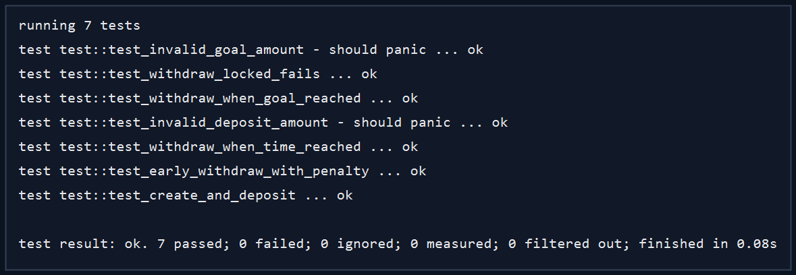

# VaultLock

VaultLock is a secure, decentralized savings application built on the Stellar network using Soroban smart contracts. It empowers users to create personal savings vaults, deposit funds incrementally, and enforce strict withdrawal rules based on either a target savings goal or a specific unlock date.

By leveraging Stellar's low fees and fast finality, VaultLock makes micro-savings and automated recurring deposits highly practical and cost-effective.

## Key Features

- **Goal-Based Savings:** Set a target XLM amount. Withdrawals are locked until the goal is fully funded.
- **Time-Locked Savings:** Set an unlock timestamp. Funds cannot be withdrawn until the specified date is reached.
- **Early Withdrawal Penalties:** Need funds early? VaultLock supports an optional early withdrawal path that enforces a predefined penalty fee, encouraging disciplined saving.
- **Cross-Contract Analytics:** Emits detailed events and metrics to a separate Analytics contract, demonstrating advanced cross-contract calls and composability on Soroban.
- **Responsive Dashboard:** A modern, mobile-friendly React frontend that interacts seamlessly with the Freighter wallet.

## Project Structure

```text
StellarVault/
├── contracts/
│   ├── analytics/                # Secondary Soroban contract for event logging
│   │   ├── src/
│   │   │   └── lib.rs            # Analytics contract logic
│   │   └── Cargo.toml            # Analytics dependencies
│   └── vaultlock/                # Primary Soroban savings vault contract
│       ├── src/
│       │   ├── lib.rs            # Vault management, deposits, and withdrawals
│       │   └── test.rs           # Unit tests and mock environment setups
│       └── Cargo.toml            # VaultLock dependencies
├── frontend/                     # React + TypeScript Web Application
│   ├── src/
│   │   ├── components/           # UI components
│   │   ├── App.tsx               # Main application and state management
│   │   └── index.css             # Vanilla CSS styling
│   ├── public/                   # Static assets
│   ├── package.json              # Frontend dependencies
│   └── vite.config.ts            # Vite bundler configuration
├── .github/workflows/            # CI/CD pipeline configuration
├── proof/                        # Output screenshots and evidence
├── ARCHITECTURE.md               # Technical design and storage models
├── RELEASE_NOTES.md              # Version history
└── README.md                     # Project documentation (You are here)
```

## Clickable Evidence Links

| Item | Status | Link |
| --- | --- | --- |
| Live Demo | ✅ Done | [https://stellar-vault-mu.vercel.app/](https://stellar-vault-mu.vercel.app/) |
| Contract ID | ✅ Done | [CC6ZFLCLHA...](https://stellar.expert/explorer/testnet/contract/CC6ZFLCLHA47H64NRZFBD65RLJBOTWW5AJCXEBUWASAIYZLCMU7UPZFX) |
| Deployment TX | ✅ Done | [6d89041507...](https://stellar.expert/explorer/testnet/tx/6d89041507874de018b73956e51017ef464b7b22f8468344345141d8a618c2c7) |
| Upload TX | ✅ Done | [b76ca5d844...](https://stellar.expert/explorer/testnet/tx/b76ca5d844bfa43af692c5ef90d6eb3e0d860e73dad4240fc11ac57d3) |

## Screenshots

### CI/CD


### Desktop Screenshot


### Mobile Screenshot


### Tests


## Contract API

- `initialize(fee_recipient, penalty_bps)`
- `create_vault(owner, title, goal_amount, unlock_timestamp, asset)`
- `deposit(depositor, vault_id, amount)`
- `withdraw(vault_id)`
- `early_withdraw(vault_id)`
- `get_vault(vault_id)`
- `get_user_vaults(owner)`

## Local Development

### Contract Validation

```bash
cd contracts/vaultlock
cargo test
```

### Running the Frontend

```bash
cd frontend
npm install
npm run dev
```

### Connect Freighter and Run

1. Start the frontend, then open `http://localhost:5173`.
2. Click **Connect Freighter** and approve wallet access.
3. The dashboard loads vaults from the testnet contract.
4. Use **New vault** to create a savings vault, then **Deposit** or **Withdraw** when the contract marks it ready.
5. To point the app at another deployment, set `VITE_VAULTLOCK_RPC_URL`, `VITE_VAULTLOCK_NETWORK_PASSPHRASE`, and `VITE_VAULTLOCK_CONTRACT_ID` in `frontend/.env`.

## Deployment Notes

- The Soroban contracts are actively deployed to the Stellar Testnet.
- The frontend is connected to the deployed contract ID configured in `contracts/vaultlock/testnet_config.json`.
- The Live Demo is hosted on Vercel and builds automatically from the `main` branch.

## Submission Checklist

- [x] Public GitHub repository
- [x] Comprehensive README documentation
- [x] Minimum 15+ meaningful commits
- [x] Live demo link
- [x] Contract deployment address
- [x] Transaction hash for contract interaction
- [x] Screenshots for UI and mobile layout
- [x] Proof of 10+ wallet interactions
